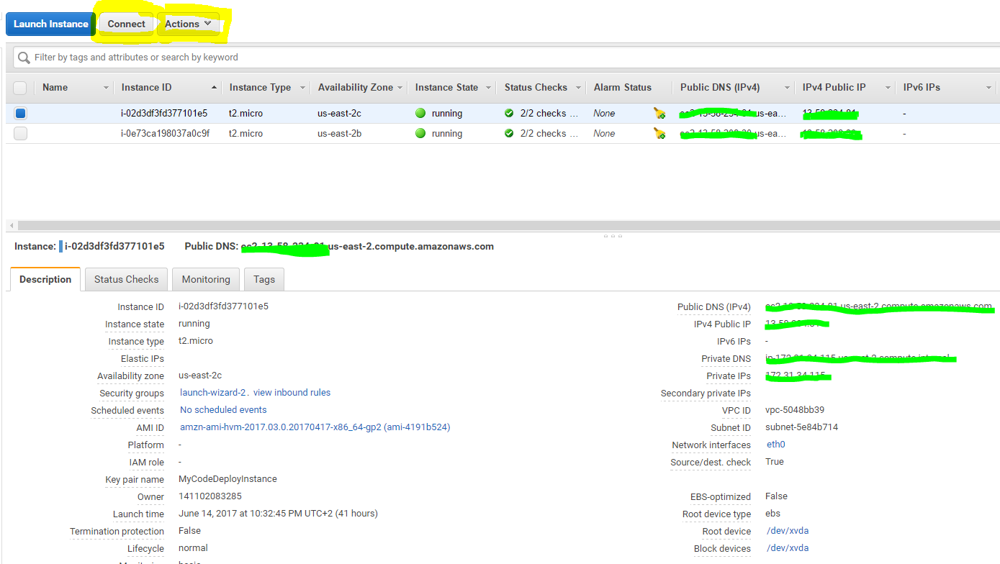
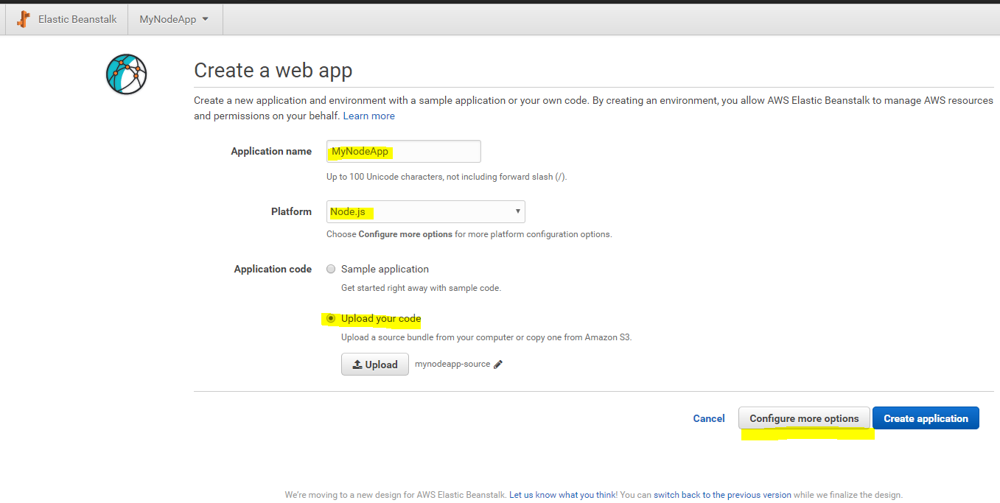
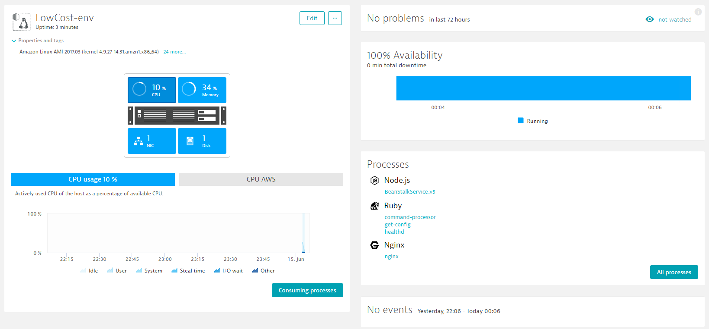
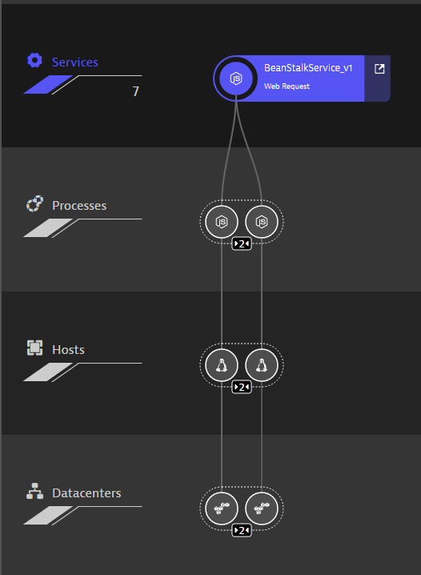
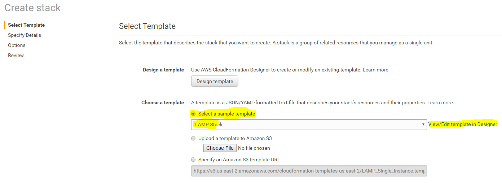
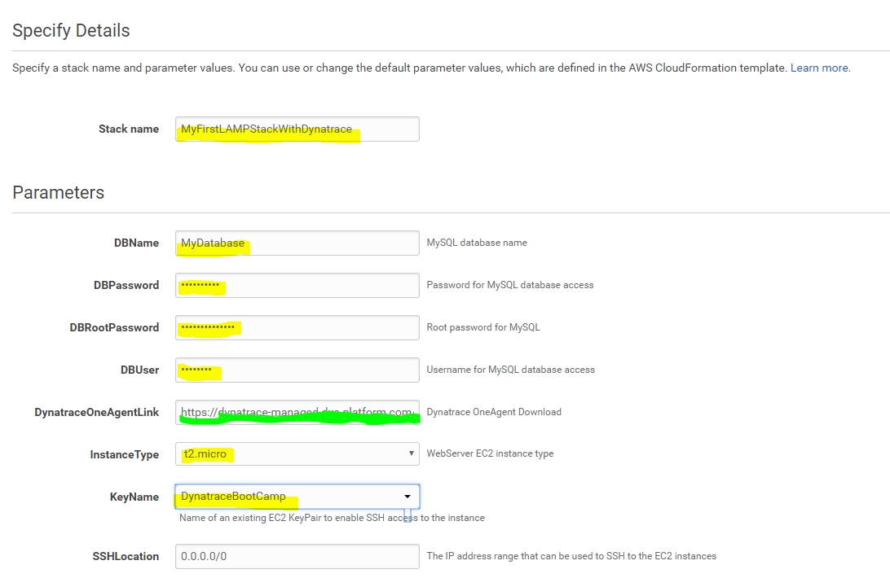
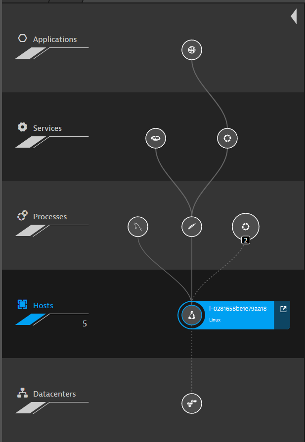
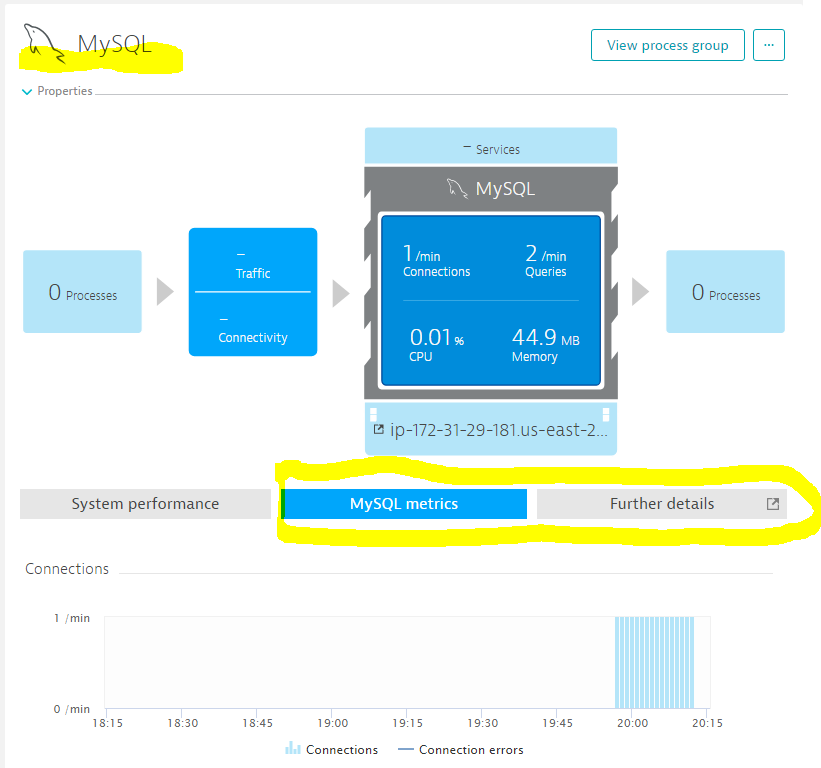
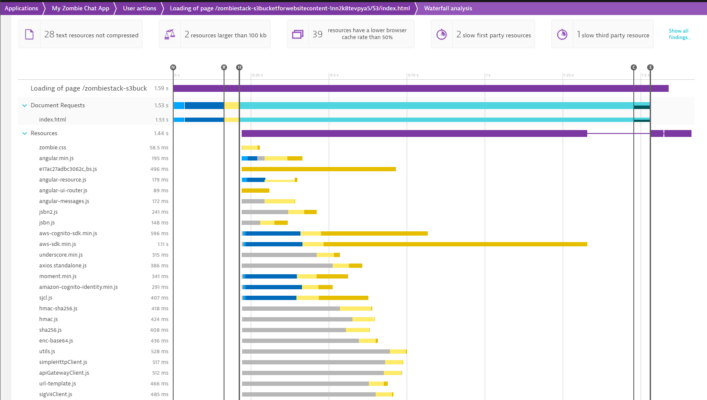

# AWS Monitoring Tutorials for Dynatrace SaaS/Managed

In this tutorial we have different labs where we learn different use cases on how to monitor applications and services on AWS with Dynatrace SaaS. The same will also work if you have Dynatrace Managed installed On-Premise. Also remember: Dynatrace can not only monitor your AWS Environments but all your Apps deployed on premise, Azure, OpenStack, OpenShift, VMWare or anywhere else!

1. [Lab 1: Setting up AWS Monitoring through Cloud Watch Integration](#lab-1-setup-dynatrace-aws-monitoring-integration)
2. [Lab 2: Monitoring EC2 Instances with Dynatrace OneAgent](#lab-2-install-oneagent-on-ec2-instance)
3. [Lab 3: Monitoring Node.JS deployed through AWS Beanstalk](#lab-3-monitor-nodejs-beanstalk-application)
4. [Lab 4: Monitoring LAMP Stack configured through CloudFormation](#lab-4-monitor-lamp-stack-configured-through-cloudformation)
5. [Lab 5: AWS ECS Container Monitoring](#lab-5-aws-ecs-container-monitoring)
6. [Lab 6: AWS CodeDeploy - Blue / Green Deployment](#lab-6-aws-codedeploy---blue--green-deployment)
7. [Lab 7: AWS Lambda Zombie Workshop with Manual RUM Injection](#lab-7-aws-lambda-zombie-workshop)

## Pre-Requisits
1. You need an AWS account. If you dont have one [get one here](https://aws.amazon.com/)
2. You need a Dynatrace Account. Get your [Free SaaS Trial here!](http://bit.ly/dtsaastrial)

## Preparation
**Amazon**
1. To remote into EC2 Instances we will need a Key Pair. Create one in preparation or once you walk through the lab
2. To learn more about Key Pairs and how to connect to EC2 Instances read [Connect to your Linux Instance](https://docs.aws.amazon.com/AWSEC2/latest/UserGuide/AccessingInstances.html) 

**Dynatrace OneAgent Download Instructions**
1. In your Dynatrace SaaS or Managed Portal navigate to Deploy Dynatrace -> Start Installation -> Linux 
2. Copy the OneAgent Download and Installation command line (circled in red) as we will need it throughout the labs


# Lab 1 Setup Dynatrace AWS Monitoring Integration
This lab will teach us how to setup the Dynatrace AWS Monitoring Integration with AWS CloudWatch. 
The goal is to see the Dynatrace AWS Monitoring Dashboard populuated with data pulled from both [AWS CloudWatch](https://aws.amazon.com/cloudwatch/) as well as from installed OneAgents:


**Step-by-Step Guide**
1. For Dynatrace SaaS please open [Dynatrace Doc: How do I start Amazon Web Service Monitoring](https://help.dynatrace.com/infrastructure-monitoring/amazon-web-services/how-do-i-start-amazon-web-services-monitoring/). For Dynatrace Managed check out [Dynatrace Doc: How do I monitor AWS using role-based access?](https://help.dynatrace.com/dynatrace-managed/dynatrace-server/how-do-i-monitor-aws-using-role-based-access/)
2. Follow the instructions for either Role or Key-based authentication
3. Tip for Role-based: Make sure you remember the Role Name, your AWS Account ID and the External ID while creating the role. You will need it at the very last step of the configuration
4. Tip for Key-based authentication: For quick evaluation I think this is the easiest path assuming your AWS User has the [required policies attached](http://assets.dynatrace.com/global/resources/aws-policy.json).
4. Once done Validate that Dynatrace shows data in the AWS Dashboard. Simply click on "AWS" in the Dynatrace menu and you should see a simliar screen as shown above

**Costs:** AWS charges for CloudWatch API access when exceeding 1 million requests. More details can be found in the Dynatrace and CloudWatch Documentation

# Lab 2 Install OneAgent On EC2 Instance
This lab will teach us how to install a Dynatrace OneAgent on a Linux EC2 Instance. 
The goal is that the EC2 host will show up in Dynatrace and is fully monitored through a OneAgent


There are multiple ways to install a Dynatrace OneAgent on a "bare" EC2 Instance. If configuration management tools such as Puppet, Chef, Ansible or AWS CodeDeploy are used then Dynatrace OneAgent deployment can be done through these tools.
Another very convenient approach for EC2 is to specify startup scripts that automatically get executed whenever Amazon launches an EC2 instances. In EC2 this is called "User Data".

**Step-by-Step Guide**
1. Logon to AWS and navigate to EC2. [This link](https://us-east-2.console.aws.amazon.com/ec2/v2/home) should also get you there!
2. Now select the option to **Launch a new Instance**
3. Select **Amazon Linux AMI** and then select the free tier eligible **t2.micro** instance type. Select Next
4. **Configure Instance:** Expand the Advanced section and specify the following User Data script (make sure you use your unique OneAgent Download URI) 
```
#!/bin/bash
wget -O Dynatrace-OneAgent-Linux.sh https://YOUR.FULL.DYNATRACE.ONEAGENT.DOWNLOADLINK
/bin/sh Dynatrace-OneAgent-Linux.sh APP_LOG_CONTENT_ACCESS=1 INFRA_ONLY=0
```
5. Click next and make yourself familiar with Storage options. We keep the defaults 
6. **Add Tags:** on this configuration screen we add a custom tag. Key=EC2InstanceType; Value=LabExcercise. 
7. Click through the rest of the steps. Review settings and click Launch
8. **Select or create** a new key pair. We will need this for remoting into EC2
9. You can observe the launch log
10. Navigate to the Dynatrace Hosts list and wait until the host shows up. Click on it and explore what is monitored
11. Expand the list of Properties and Tags. We should also find our EC2InstanceType tag with the value LabExcercise

**Troubleshooting:**
If something doesnt go as expected what to do? Well - Amazon provides a good way to access these EC2 instances
1. Navigate to your [EC2 Manager Console](https://us-east-2.console.aws.amazon.com/ec2/v2/home)
2. Select the EC2 instance in question
3. Explore the options such as **Connect** and follow the instructions to remote into that machine. 
4. Explore **Actions -> Instance Settings -> Get System Log** to get access to the system log and verify what happened during startup


**Useful Links**
* [Running commands on your Linux Instance during Startup](http://docs.aws.amazon.com/AWSEC2/latest/UserGuide/user-data.html)
* [Running commands on your Windows Instance during Startup](http://docs.aws.amazon.com/AWSEC2/latest/WindowsGuide/UsingConfig_WinAMI.html#user-data-execution)

# Lab 3 Monitor-NodeJS-Beanstalk-Application
This lab will teach us how to install a Dynatrace OneAgent into a Node.js application deployed with AWS Beanstalk.
As a base we use the sample node.js application that AWS uses in their tutorials. For more information see ...
The goal of this lab is to have full Node.js and End User monitoring enabled with Dynatrace.

**Background Information on Beanstalk**

Beanstalk allows you to simply upload your application code as a zip or war file to AWS. AWS Beanstalk then 
1. Launches a new EC2 instance for you with the required runtime (Node.js, PHP, Java, .NET ...)
2. Extracts your ZIP/WAR file onto that machine
3. Sets Environment Variables and executes startup scripts to prepare the environment#
4. Launches the runtime environment (Node.js, PHP, Java, .NET ...)

*Installing OneAgent on Beanstalk*
One way to install a Dynatrace OneAgent on such a Beantstalk EC2 instance is to leverage the "Elastic Beanstalk Extensions" concept. Beanstalk allows you to put additonal configuraton and script instructions into a subfolder called .ebextensions. Files with the ending .config will then be analyzed and executed during the startup phase of an instance. In our example you will find the following files in the .ebextension directory:
* dynatrace.config: Defines one Configuration Option (DYNATRACE_ONEAGENT_DOWNLOAD). It also comes with a special beanstalk installation script that gets put into a special directory which will be executed by Beanstalk as part of the instance launch process. This script references the DYNATRACE_ONEAGENT_DOWNLOAD option. You could either set the option value in the .config file before uploading it to AWS or you can set the value later when configuring the launch parameters. We will do THE LATTER.
* version.config: This config files specifies additional environment variables that are set to the EC2 instance. It can be used to demonstrate custom process group tagging with Dynatrace

**Prerequisit**
1. Download the NodeJSBeanStalkSample from this GitHub Repo
2. Explore the .ebextensions directory as explained above
3. Create a ZIP file of the full NodeJSBeanStalkSample including .ebextension directory

**Step-by-Step-Guide**
1. Logon to AWS and Navigate to Elastic Beanstalk. [This link](https://us-east-2.console.aws.amazon.com/elasticbeanstalk/home) should also get you there
2. **Create a new application**
3. Give it a name. Select **Node.js** as the platform and **upload your zip** file. Then click on **Configure more options**

4. Click on Software Options and add DYNATRACE_ONEAGENT_DOWNLOAD with the full download URL for your OneAgent. Click on Save

5. Now its time to launch the environment
6. Once the environment is up and running we can access the website. It is a very simply one page website that is delivered by Node.js. Dynatrace OneAgent will automatically inject the JavaScript Tag for Real User Monitoring. You can verify that.


**Additional Step: Process Group Identification**
Dynatrace automatically detects process groups and by default does a pretty good job in detecting the logical application deployed by looking at different environment variables or application server configuration files. If you want to override that process you can configure a custom Process Group Detection Rule. In our version.config file we specify a custom environment variable called MYVERSION. In this additional step we simply configure dynatrace to detect the Process Group Name based on that value in case this environment variable is set.
1. In Dynatrace go to Settings -> Monitoring -> Process group detection
2. Add a new rule for Node.js and specify MYVERSION as the environment variable to look at
3. Next time you launch your application you will see Dynatrace will capture that value of our MYVERSION Environment Variable

**Additional Step: Load Balancing**
1. Go to your Beanstalk Environment in AWS Console
2. Click on Configuration - Scaling
3. Change the environment type to "Load balancing, auto scale"
4. Apply the changes and let Beanstalk restart
5. Go back to the same settings after restart and change auto scale to minimum instances of 2
6. Apply changes and validate that Dynatrace detects both instances

**Additional Step: Real User Monitoring**
There are some additional RUM configurations we can define to better leverage Dynatrace Real User Monitoring
1. Enable jQuery support for our Beanstalk Application. You can configure this through the Web Application Settings!
2. Configure Cookie Support for elasticbeanstalk.com domains: If you host your app on the default domain given by AWS you have to go into the Advanced Settings for your Application and specify your full domain name, e.g: custom-env.ub2cp9hmpy.us-west-2.elasticbeanstalk.com in the field **Domain to be used for cookie placement**. Otherwise your browser will reject the Dynatrace Cookies necessary for end user tagging. This step IS NOT necessary if you host your app on a "normal" domain! 
3. [Configure User Tagging](https://www.dynatrace.com/blog/automatic-identification-users-based-page-metadata/). The Application has a login button which will then set the Username to an HTML Element with the ID #loggedinusername. Please configure User Tagging by picking up that value through CSS Selectors
Now you should be able to find your user by looking for the user name and see every single interaction with any button. 
*REMEMBER:* User Visits right now will show up once the Visits are completed which means after the 30 minutes timeout!

**Additional Step: Request Tagging**
Dynatrace provides a great way to dynamically tag web requests based on information passed to each web request. In our sample app we have calls to /api/version, /api/invoke, ...
1. Go to Settings -> Server-Side -> [Request attributes](https://www.dynatrace.com/blog/request-attributes-simplify-request-searches-filtering/)
2. Configure tagging for the pattern /api/\* and for the parameter text on /api/echo?echo=
Try it out and then perform web request analysis based on these tags!

Here is what you should see if you go to Smartscape. Dynatrace shows the logical Node.js service. The name BeanStalkService_v1 is actually taken from our previously defined custom process group detection. We also see that this service runs on 2 Node.js instances on two different EC2 hosts in two Availability Zones:


**Useful Links**
* [What Is AWS Beanstalk](http://docs.aws.amazon.com/elasticbeanstalk/latest/dg/Welcome.html)
* [Dynatrace Blog:Set up custom process group monitoring](https://www.dynatrace.com/blog/set-custom-process-groups-monitoring/)
* [Request Attribute Tagging](https://www.dynatrace.com/blog/request-attributes-simplify-request-searches-filtering/)
* [User Tagging with Dynatrace](https://www.dynatrace.com/blog/automatic-identification-users-based-page-metadata/)

# Lab 4 Monitor LAMP Stack configured through CloudFormation
This lab will teach us how to use a pre-configured CloudFormation stack to configure a classical LAMP stack. We will inject the Dynatrace OneAgent into the User Data portion of the EC2 instance launch by changing the CloudFormation template. This will allow us to create multipl stacks of the same LAMP stack including Dynatrace OneAgent monitoring

**Step-by-Step-Guide**
1. Logon to AWS and navigate to the [CloudFormation Service](https://us-east-2.console.aws.amazon.com/cloudformation/home)
2. **Create a new Stack**: Select LAMP Stack and then click on *View/Edit template*

3. We are going to add one new parameter: _DynatraceOneAgentLink_ which users can later provide. Simply add the following code snipped to the parameters in the JSON Editor
```
    "DynatraceOneAgentLink": {
        "Description": "Dynatrace OneAgent Download",
        "Type": "String",
        "MaxLength": "256",
        "ConstraintDescription": "Full Download Link to your Dynatrace OneAgent. Get this from your Settings -> Deploy screen in your Dynatrace SaaS/Managed console"
    }, 
```
4. Now we are going to add a similar User Data startup script as we did when instrumenting a regular EC2 Instance launch. Scroll down to the "UserData" Property Definition. Right after the line "yum update -y aws-cfn-bootstrap\n" we will add the following code.:
```
            "# Install Dynatrace OneAgent\n",
            "cd /home/ec2-user\n",
            "wget -O Dynatrace-OneAgent-Linux.sh ",
            {
                "Ref": "DynatraceOneAgentLink"
            },
            "\n",
            "/bin/sh Dynatrace-OneAgent-Linux.sh APP_LOG_CONTENT_ACCESS=1\n",
```
5. **Click on "Validate Template"** in the toolbar to make sure you have no typos. **PROBLEMS??** If you dont waste too much time feel free to copy/paste the [complete template from here!](/LAMPCloudFormationSample/LAMPTemplateWITHDynatraceOneAgent)
6. Now we have a CloudFormation script that will launch a LAMP Stack but that will also install a Dynatrace OneAgent where the actual download link is configurable through _DynatraceOneAgentLink_.
7. **Click on Create Stack** in the toolbar. This will get you back to the previous screen with your new template already uploaded to S3
8. **Click on Next**
9. Now we have to fill out all the parameters - including our _DynatraceOneAgentLink_. Please choose a good name for the stack and provide the passwords for the database properties. When done **Click Next**

10. **Options**: Here you could define additonal tags that would automatically be picked up by Dynatrace OneAgent. Feel free to define a tag and explore that option. Once done **Click Next**
11. **Review**: Review your settings - then **Click Create**
12. You will end up in the Stack List. TIP: if your Stack doesnt show up click the Refresh button! It will take a while until everything is fully created!
13. Once the environment is in status *CREATE_COMPLETE* select the entry and find the URL to your enviornment in the Output tab in the bottom. Open that URL. You will see that PHP returns its standard page.
14. **Dynatrace**: Now move over to Dynatrace and explore the data collected. If you click on Technology you should see Apache and MySQL show up. Click on Apache, expand the bottom list of process groups and click on Proces Group Details. From there you can navigate further to the actual process group and explore more about the data captured:

Navigating to the Smartscape actually shows you how Dynatrace OneAgent really automatically detects every single process on that EC2 Linux instance including MySql and some other native processes


**Optional Step: MySQL Monitoring**
As the LAMP stack comes with MySQL we can easily setup [MySQL Monitoring with Dynatrace](https://www.dynatrace.com/technologies/database/mysql-monitoring/mysql-performance/).
Follow these steps
1. Click on Technologies and find the MySQL tile (notice the tile is light blue which means no deep monitoring in the moment)
2. Click on the tile and navigate your way through the process groups until you end up on your MySQL Process Group.
3. Follow the instructions to enable MySQL Monitoring. You will be able to specify username and password for Dynatrace to query your MySQL Database
4. Once you are done you will see MySQL Metrics in your MySQL Process Group. Explore the _MySQL metrics_ as well as in _Further details_


**Useful Links**
* [AWS CloudFormation documentation](https://aws.amazon.com/documentation/cloudformation/)

# Lab 5 AWS ECS Container Monitoring

If you are new to ECS and want to get a quick start I recommend walking through the sample application deployment wizard. This wizard will create 
1. Your First ECS Cluster
2. A EC2 Launch Configuration
3. A Auto Scaling Group using that Launch Configuration
4. A Task that runs a sample web site in a container

In order to get Dynatrace Monitoring into that wizard generated scenario I found the easiest to modify the EC2 Launch Configuration and adding the Dynatrace OneAgent Installation steps to the User Data confiugration. As AWS doesnt allow to edit an existing Launch Configuration we have to copy it, modify it and then change the Auto Scaling group to point to our new Launch Configuration.
Here are the steps involved
1. Make a copy of the Wizard generated Launch Configuration
2. Edit the User Data portion and add the OneAgent Installation steps. *ATTENTION:* The default AMI that is used for ECS EC2 Container Instances doesnt come with wget but it comes with curl. I also noticed I have to execute the install script with sudo in order for the installation script to run as root. Here is the code snippet that should work:
```
#!/bin/bash
curl -O Dynatrace-OneAgent-Linux.sh https://YOUR.FULL.DYNATRACE.ONEAGENT.DOWNLOADLINK
sudo /bin/sh Dynatrace-OneAgent-Linux.sh APP_LOG_CONTENT_ACCESS=1 INFRA_ONLY=0
```
3. Edit the Auto Scaling Group and configure it to use your new EC2 Launch Configuration
4. Terminate the current EC2 Instances that were created previously. The Auto Scaling Group will make sure to launch new ones but now using your new Launch Configuration

THATS IT :-)

# Lab 6 AWS CodeDeploy - Blue / Green Deployment

Similar to the ECS Lab I suggest you use the wizard that will create all configuration entries to deploy an app using a Blue/Green Deployment model. And just as we did in the ECS Lab I think the best way to inject the Dynatrace OneAgent is to duplicate the EC2 Launch Configuration, add the OneAgent Installation steps and then use this new Launch Configuration for the Auto Scaling Group that the wizard also created. That should do the trick!

Here is a screenshot of my User Data configuration for the edited Launch Configuration. You can see the OneAgent installation procedure I added just before the AWS CodeDeploy Agent gets installed


# Lab 7 AWS Lambda Zombie Workshop
This lab from Amazon promotes Servless technology. It is often used on AWS Servless Meetups and Hackathons.
Please follow the instructions on the [AWS Lambda Zombie Workshop GitHub Repo](https://github.com/awslabs/aws-lambda-zombie-workshop). 
For the Dynatrace lab we do not need to go through the full excercise. Just the initial deployment of the app and inintial configuration steps are sufficient to get the app up& running.

Once the application is deployed you will see that Dynatrace automatically monitors those resources used by this application: DynamoDB and Lambdas (through our AWS Monitoring Integration)

**Enable Real User Monitoring**
In order to enable Real User Monitoring we have to manually inject the Dynatrace JavaScript Tag because the HTML pages are static files delivered through S3.
Follow these steps to get this accomplished
1. Go to S3 and browse to the index.html page in the zombiestack S3 bucket
2. Download that index.html page
3. In Dynatrace setup agentless monitoring for a new Zombie App. Copy that JavaScript snippet
4. Edit the local index.html page and add the JavaScript snippet in the <head> of the html file
5. Upload the modified index.html file
From now on, every time you access the Zombie Web Application the Dynatrace JavaScript Agent will be loaded. This means that you have automatic real end user monitoring!

