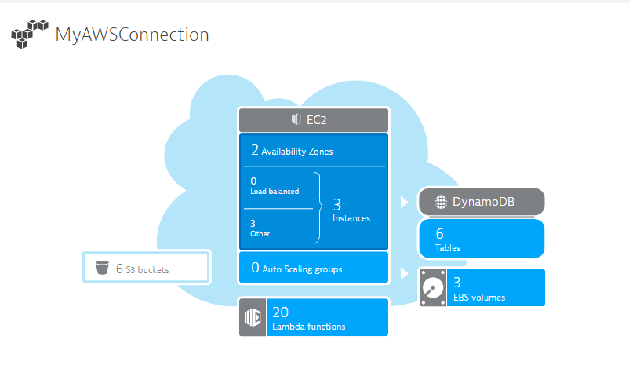
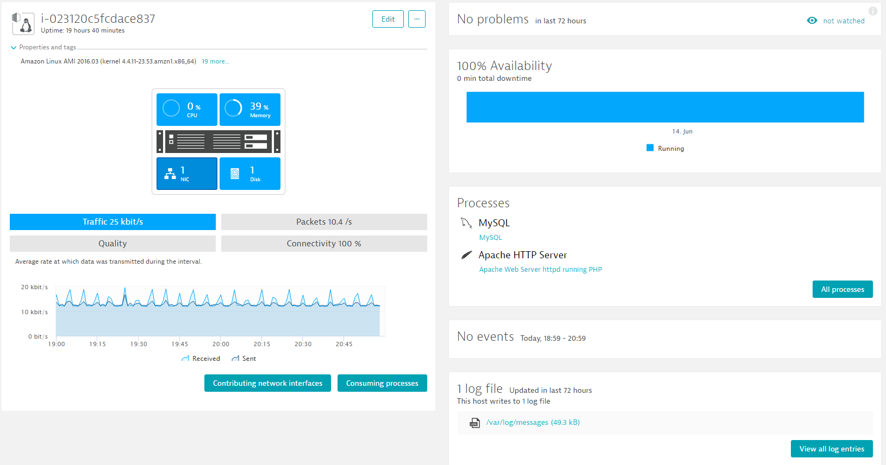

# AWSMonitoringTutorials

In this tutorial we have different labs where we learn different use cases on how to monitor applications and services on AWS with Dynatrace SaaS. 

1. [Setting up AWS Monitoring through Cloud Watch Integration](#lab-1-setup-dyntrace-aws-monitoring-integration)
2. [Monitoring EC2 Instances with Dynatrace OneAgent](#lab-2-install-oneagent-on-ec2-instance)
3. [Monitoring Node.JS deployed through AWS Beanstalk](#lab-3-monitor-nodejs-beanstalk-application)
4. [AWS Lambda Zombie Workshop with Manual RUM Injection](#lab-4-aws-lambda-zombie-workshop)

## Pre-Requisits
1. You need an AWS account. If you dont have one [get one here](https://aws.amazon.com/)
2. You need a Dynatrace SaaS Account. Get your [Free Trial here!](http://bit.ly/dtsaastrial)

## Preparation
1. In your Dynatrace SaaS Portal navigate to Deploy Dynatrace -> Start Installation -> Linux 
2. Copy the OneAgent Download and Installation command line (circled in red) as we will need it throughout the labs
3. Also make a note of your TenantID and Token (two green marks) as we will also need it later


# Lab 1 Setup Dynatrace AWS Monitoring Integration
This lab will teach us how to setup the Dynatrace AWS Monitoring Integration. 
The goal is to see the AWS Monitoring Dashboard populuated with data pulled from both Cloud Watch as well as from installed OneAgents


Step-by-Step Guide
1. Logon to AWS and navigate to EC2. [This link](https://us-east-2.console.aws.amazon.com/ec2/v2/home) should also get you there!
2. Now select the option to **Launch a new Instance**
3. Select **Amazon Linux AMI** and then select the free tier eligible **t2.micro** instance type. Select Next
4. **Configure Instance:** Expand the Advanced section and specify the following User Data script (make sure you use your unique OneAgent Download URI) 
```
#!/bin/bash
wget -O Dynatrace-OneAgent-Linux.sh https://YOURTENANT.live.dynatrace.com/installer/oneagent/unix/latest/YOURTOKEN
/bin/sh Dynatrace-OneAgent-Linux.sh APP_LOG_CONTENT_ACCESS=1 INFRA_ONLY=0
```

4. Click through the configuration steps and learn which options are available 
5. Add Tags: on this configuration screen we add a custom tag. Key=EC2InstanceType; Value=LabExcercise


Useful Links
* [Dynatrace Doc: How do I start Amazon Web Service Monitoring](https://help.dynatrace.com/infrastructure-monitoring/amazon-web-services/how-do-i-start-amazon-web-services-monitoring/)

# Lab 2 Install OneAgent On EC2 Instance
This lab will teach us how to install a Dynatrace OneAgent on a Linux EC2 Instance. 
The goal is that the EC2 host will show up in Dynatrace and is fully monitored through a OneAgent


There are multiple ways to install a Dynatrace OneAgent on a "bare" EC2 Instance. If configuration management tools such as Puppet, Chef, Ansible or AWS CodeDeploy are used then Dynatrace OneAgent deployment can be done through these tools.
Another very convenient approach for EC2 is to specify startup scripts that automatically get executed whenever Amazon launches an EC2 instances. In EC2 this is called "User Data".

Useful Links
* [Running commands on your Linux Instance during Startup](http://docs.aws.amazon.com/AWSEC2/latest/UserGuide/user-data.html)
* [Running commands on your Windows Instance during Startup](http://docs.aws.amazon.com/AWSEC2/latest/WindowsGuide/UsingConfig_WinAMI.html#user-data-execution)

# Lab 3 Monitor-NodeJS-Beanstalk-Application
This lab will teach us how to install a Dynatrace OneAgent into a Node.js application deployed with AWS Beanstalk.
As a base we use the sample node.js application that AWS uses in their tutorials. For more information see ...
The goal of this lab is to have full Node.js and End User monitoring enabled with Dynatrace.

Useful Links
* [What Is AWS Beanstalk](http://docs.aws.amazon.com/elasticbeanstalk/latest/dg/Welcome.html)


# Lab 4 AWS Lambda Zombie Workshop
This lab from Amazon promotes Servless technology. It is often used on AWS Servless Meetups and Hackathons.
Please follow the instructions on the [AWS Lambda Zombie Workshop GitHub Repo](https://github.com/awslabs/aws-lambda-zombie-workshop). 
For the Dynatrace lab we do not need to go through the full excercise. Just the initial deployment of the app and inintial configuration steps are sufficient to get the app up& running.

Once the application is deployed you will see that Dynatrace automatically monitors those resources used by this iapplication: DynamoDB and Lambdas
In order to enable Real User Monitoring we have to manually inject the Dynatrace JavaScript Tag because the HTML pages are static files delivered through S3.

The goal of this tutorial therefore is to see Dynatrace monitor DynamoDB, Lambda and Real User Activity.
